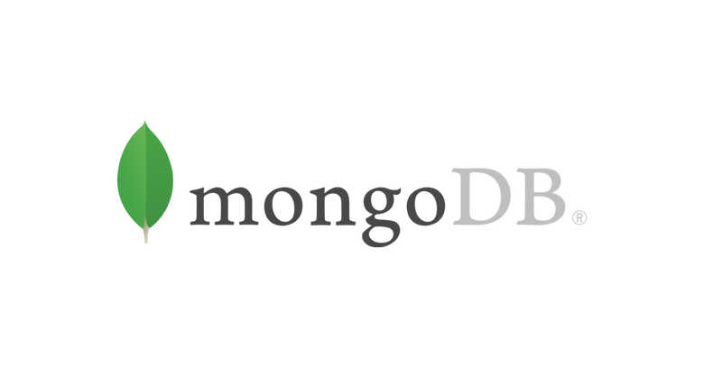

# Docker MongoDB e MySQL
> Material que uso local para teste com MongoDB

<p align="center"></p>

> To run the test for this package, run:

```sh
docker-compose up
```
> OR `docker run --detach --name=test-mysql -p 52000:3306  --env="MYSQL_ROOT_PASSWORD=mypassword" mysql`

## Configuração para Laravel
> You can use MongoDB either as the main database, either as a side database. To do so, add a new mongodb connection to config/database.php:

```php
'mongodb' => [
    'driver' => 'mongodb',
    'host' => env('DB_HOST', '127.0.0.1'),
    'port' => env('DB_PORT', 27017),
    'database' => env('DB_DATABASE', 'homestead'),
    'username' => env('DB_USERNAME', 'homestead'),
    'password' => env('DB_PASSWORD', 'secret'),
    'options' => [
        // here you can pass more settings to the Mongo Driver Manager
        // see https://www.php.net/manual/en/mongodb-driver-manager.construct.php under "Uri Options" for a list of complete parameters that you can use

        'database' => env('DB_AUTHENTICATION_DATABASE', 'admin'), // required with Mongo 3+
    ],
],
```
## For multiple servers or replica set configurations, set the host to an array and specify each server host:


```php
'mongodb' => [
    'driver' => 'mongodb',
    'host' => ['server1', 'server2', ...],
    ...
    'options' => [
        'replicaSet' => 'rs0',
    ],
],

```
## Laravel Eloquent
> Extending the base model
> This package includes a MongoDB enabled Eloquent class that you can use to define models for corresponding collections.

```php
use Jenssegers\Mongodb\Eloquent\Model;

class Book extends Model
{
    //
}
```
>To change the collection, pass the `$collection` property:


```php
use Jenssegers\Mongodb\Eloquent\Model;

class Book extends Model
{
    protected $collection = 'my_books_collection';
}
```

```php
use Jenssegers\Mongodb\Eloquent\Model;

class Book extends Model
{
    protected $primaryKey = 'id';
}

// Mongo will also create _id, but the 'id' property will be used for primary key actions like find().
Book::create(['id' => 1, 'title' => 'The Fault in Our Stars']);
```

## Connection Model database

```php
use Jenssegers\Mongodb\Eloquent\Model;

class Book extends Model
{
    protected $connection = 'mongodb';
}
```
## Soft Deletes | Dates

```php
use Jenssegers\Mongodb\Eloquent\SoftDeletes;

class User extends Model
{
    use SoftDeletes;

    protected $dates = ['deleted_at'];
}

```

```php
use Jenssegers\Mongodb\Eloquent\Model;

class User extends Model
{
    protected $dates = ['birthday'];
}
```

```
$users = User::where(
    'birthday', '>',
    new DateTime('-18 years')
)->get();
```

# Relationships
## Basic Usage
The only available relationships are:

- hasOne
- hasMany
- belongsTo
- belongsToMany
The MongoDB-specific relationships are:

- embedsOne
- embedsMany

```
use Jenssegers\Mongodb\Eloquent\Model;

class User extends Model
{
    public function items()
    {
        return $this->hasMany(Item::class);
    }
}
```

```
use Jenssegers\Mongodb\Eloquent\Model;

class Item extends Model
{
    public function user()
    {
        return $this->belongsTo(User::class);
    }
}
```

## belongsToMany and pivots

```php
use Jenssegers\Mongodb\Eloquent\Model;

class User extends Model
{
    public function groups()
    {
        return $this->belongsToMany(
            Group::class, null, 'user_ids', 'group_ids'
        );
    }
}
```


## Documentos Laravel MongoDB
- https://github.com/jenssegers/laravel-mongodb
- A MongoDB based Eloquent model and Query builder for Laravel (Moloquent) https://jenssegers.com

## Renato Lucena

